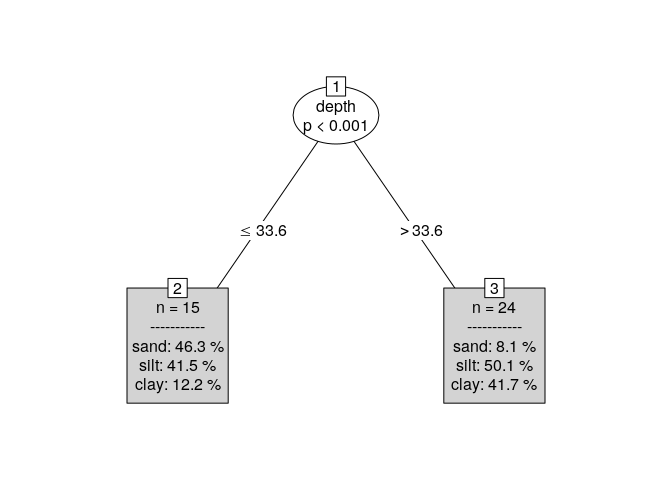

proptree
========

Compositional *or* Proportional trees in R based on model based
partiioning (MOB).

Getting started
---------------

Install from GitHub:

    devtools::install_github("meteosimon/proptree")

A first tree
------------

    library("proptree")
    data("ArcticLake", package = "DirichletReg")
    tr <- proptree(sand + silt + clay ~ depth, data = ArcticLake)
    plot(tr)

